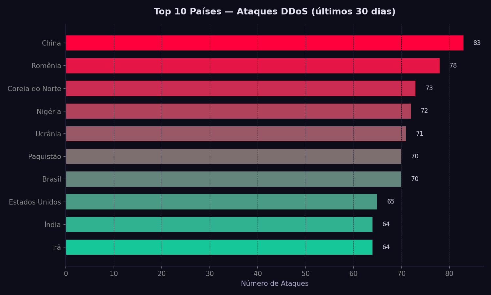
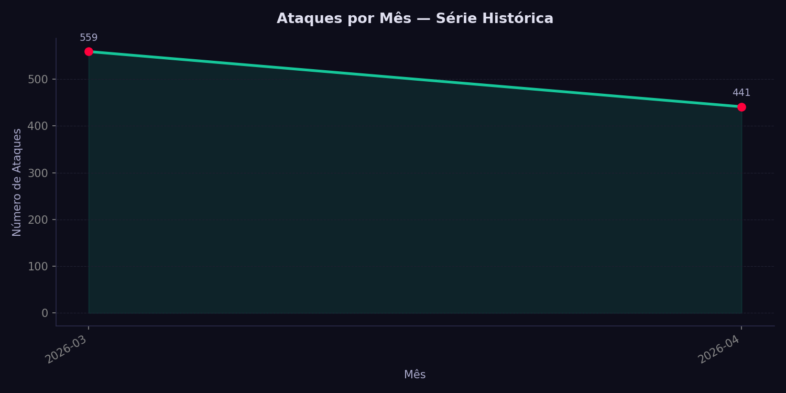
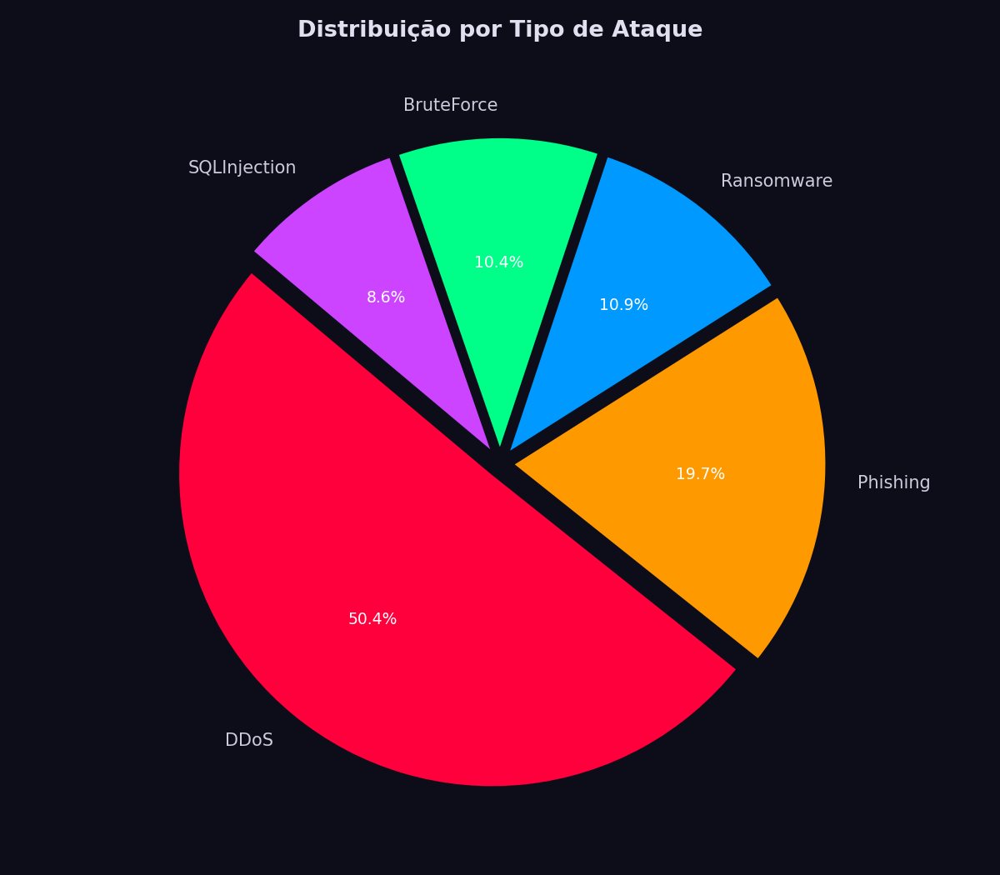

# Projeto 4 — Gráficos com Matplotlib

**Semana 3 | Python com Dados e Pandas | Kensei Cybersecurity**

Transforma dados de ataques cibernéticos em visualizações. Três gráficos são gerados e salvos automaticamente como PNG usando **Matplotlib**.

---

## Gráficos Gerados

### 1. Barras — Top 10 Países de Origem



Países com maior volume de ataques DDoS nos últimos 30 dias, ordenados do maior para o menor.

---

### 2. Linha — Ataques por Mês



Série histórica mostrando a evolução mensal do volume de ataques detectados.

---

### 3. Pizza — Distribuição por Tipo de Ataque



Fatia percentual de cada categoria: DDoS, Phishing, Ransomware, BruteForce e SQLInjection.

---

## Arquivos

| Arquivo | Descrição |
|---|---|
| `graficos.py` | Script principal — gera os 3 gráficos |
| `top10_ddos.png` | Barras horizontais: Top 10 países |
| `ataques_por_mes.png` | Linha: volume de ataques por mês |
| `tipos_ataque.png` | Pizza: distribuição por tipo |

---

## Como Executar

```bash
pip install pandas matplotlib
```

```bash
python graficos.py
```

Os três gráficos serão exibidos na tela e salvos na mesma pasta.

---

## Código Principal

```python
import pandas as pd
import matplotlib.pyplot as plt

# Barras — Top 10 países
top10 = df["pais_origem"].value_counts().head(10).sort_values()
top10.plot(kind="barh", color="#16C79A")
plt.title("Top 10 Países - DDoS")
plt.tight_layout()
plt.savefig("top10_ddos.png")

# Linha — Ataques por mês
por_mes = df.groupby("mes").size()
por_mes.plot(kind="line", marker="o", color="#16C79A")
plt.title("Ataques por Mês")
plt.savefig("ataques_por_mes.png")

# Pizza — Tipos de ataque
df["tipo"].value_counts().plot(kind="pie", autopct="%1.1f%%")
plt.title("Tipos de Ataque")
plt.savefig("tipos_ataque.png")
```

---

## Próximo Passo — Dica Pro

Quer gráficos mais bonitos? Experimente:

```bash
pip install seaborn plotly
```

- **Seaborn** — tema dark, paletas automáticas, estatísticas embutidas
- **Plotly** — gráficos interativos (zoom, hover, filtros em tempo real)

---

## Conceitos Aprendidos

| Recurso | O que faz |
|---|---|
| `ax.barh()` | Gráfico de barras horizontal |
| `ax.plot()` | Gráfico de linha com marcadores |
| `ax.pie()` | Gráfico de pizza com percentuais |
| `ax.fill_between()` | Sombra sob a linha |
| `plt.savefig("arquivo.png")` | Salva o gráfico como imagem |
| `plt.rcParams` | Configura estilo global dos gráficos |

---

*Semana 3 — Python com Dados e Pandas | Kensei Cybersecurity*
