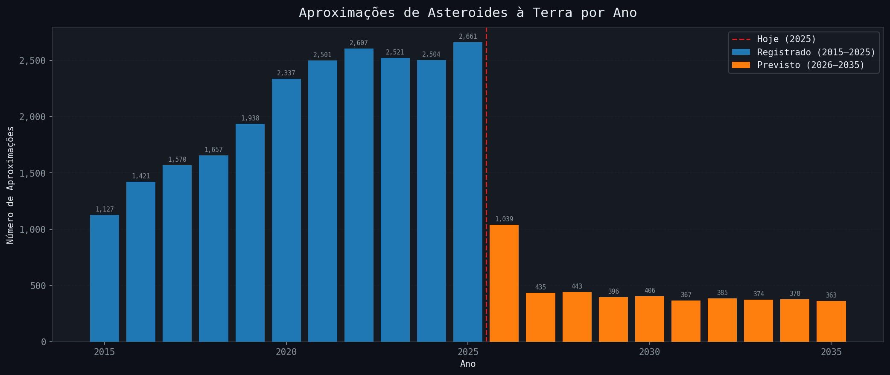
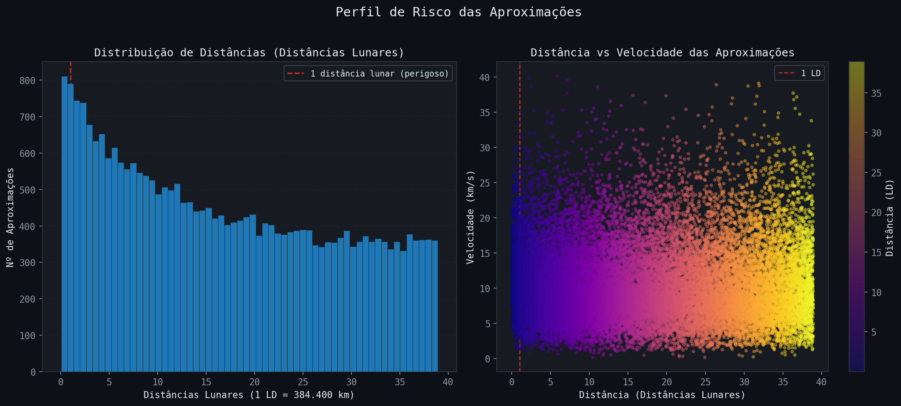
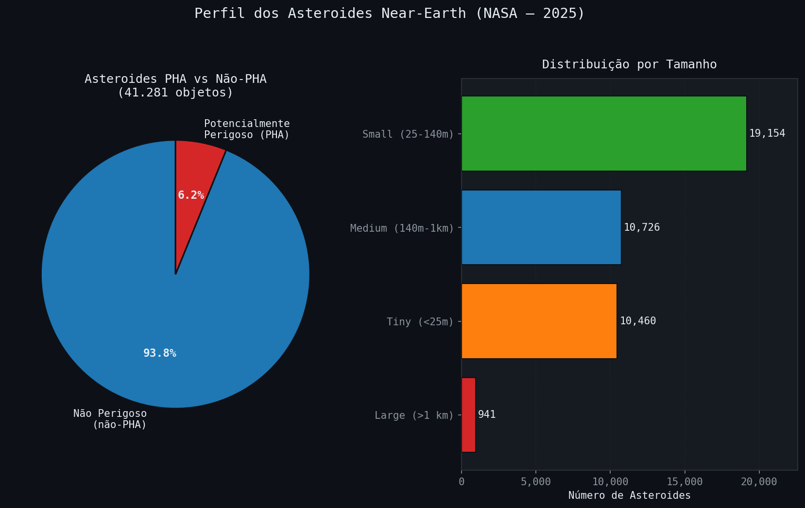
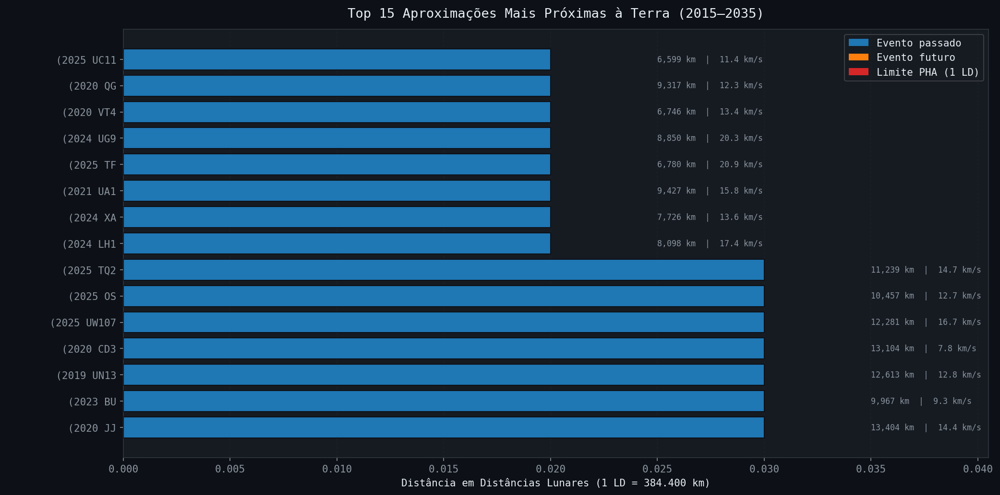
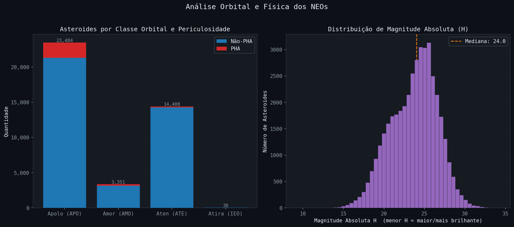

# Projeto 5: Analise Completa — Asteroides Near-Earth (NASA)

Pipeline completo de ciencia de dados aplicado a dois datasets oficiais da NASA sobre asteroides proximos a Terra: carregamento, exploracao, limpeza, analise com perguntas reais e visualizacao com Matplotlib.

---

## Fonte dos Dados

**Plataforma:** [Kaggle](https://www.kaggle.com)  
**Dataset:** [NASA Near-Earth Asteroids and Close Approaches](https://www.kaggle.com/datasets/darkmatternet/nasa-near-earth-asteroids-and-close-approaches)  
**Origem original:** [NASA Center for Near Earth Object Studies (CNEOS)](https://cneos.jpl.nasa.gov/)  
**Licenca:** Dados publicos da NASA — dominio publico  
**Formato:** CSV

O dataset foi compilado a partir de dois sistemas da NASA:

- **Small-Body Database (SBDB):** catalogo oficial de pequenos corpos do sistema solar, mantido pelo Jet Propulsion Laboratory (JPL)
- **Close Approach Data (CNEOS):** registros historicos e previsoes de aproximacoes de asteroides a Terra

---

## O que sao Asteroides NEO?

**Near-Earth Objects (NEOs)** sao asteroides ou cometas com orbitas que os aproximam a menos de 1,3 UA (Unidades Astronomicas) do Sol — o que os coloca potencialmente proximos da Terra.

Dentro dos NEOs existe uma categoria especial chamada **PHA (Potentially Hazardous Asteroid):** objetos com diametro acima de 140 metros que passam a menos de 0,05 UA da Terra (cerca de 20 distancias lunares). Sao os candidatos monitorados com maior atencao pelas agencias espaciais.

### Classes Orbitais

| Classe | Nome | Descricao |
|---|---|---|
| APO | Apolo | Cruzam a orbita da Terra — maior grupo |
| AMO | Amor | Proximos a Terra, mas nao cruzam a orbita |
| ATE | Aten | Orbita menor que a da Terra, podem cruzar |
| IEO | Atira | Orbita completamente interior a da Terra |

---

## Sobre os Datasets

### Dataset 1 — `near_earth_asteroids_2025.csv`
Catalogo com **41.281 asteroides NEO** conhecidos ate 2025.

| Coluna | Descricao |
|---|---|
| `full_name` | Nome completo do asteroide |
| `pha` | Se e Potentially Hazardous Asteroid |
| `H` | Magnitude absoluta (quanto menor, maior o objeto) |
| `diameter_km` | Diametro estimado em km |
| `size_category` | Categoria de tamanho e nivel de risco |
| `class` | Classe orbital (APO, AMO, ATE, IEO) |
| `moid_au` | Distancia minima da orbita terrestre em UA |
| `first_obs` / `last_obs` | Data da primeira e ultima observacao |

### Dataset 2 — `asteroid_close_approaches_2015_2035.csv`
**27.430 aproximacoes** de asteroides a Terra entre 2015 e 2035 — parte observada, parte prevista.

| Coluna | Descricao |
|---|---|
| `full_name` | Nome do asteroide |
| `close_approach_date` | Data e hora da aproximacao |
| `dist_km` | Distancia da Terra em km |
| `dist_lunar` | Distancia em Distancias Lunares (1 LD = 384.400 km) |
| `velocity_km_s` | Velocidade relativa em km/s |
| `is_future` | True se o evento ainda nao ocorreu |

---

## Pipeline de Analise

```
Etapa 1 — Carregar     read_csv, head, shape, info, describe
Etapa 2 — Explorar     tipos, nulos, duplicados, range de datas
Etapa 3 — Limpar       fillna (mediana), to_datetime, drop_duplicates
Etapa 4 — Analisar     filtros, groupby, contagens, estatisticas
Etapa 5 — Visualizar   5 graficos salvos como PNG
```

---

## Principais Descobertas

- **6,2%** dos 41.281 asteroides catalogados sao classificados como PHA
- **1.221** aproximacoes ocorreram a menos de 1 distancia lunar da Terra
- O asteroide **(2025 UC11)** chegou a apenas **6.599 km** da Terra — menos da metade do diametro do planeta
- A velocidade maxima registrada foi de **40,2 km/s** (~144.000 km/h)
- A classe **Apolo** domina com 23.484 objetos, todos com orbitas que cruzam a da Terra
- O ano de **2025** registra o maior numero de aproximacoes: 2.661 eventos

---

## Graficos e Analises

### Grafico 1 — Aproximacoes por Ano (2015–2035)



**O que mostra:** quantidade de aproximacoes de asteroides a Terra registradas (azul) e previstas (laranja) por ano, de 2015 a 2035.

**Conclusao:** o numero de aproximacoes cresceu continuamente entre 2015 e 2025 — reflexo direto do aumento da capacidade de deteccao dos telescopios. A queda abrupta apos 2025 nao significa que havera menos asteroides, mas que as previsoes de longo prazo ainda nao estao completamente calculadas. O ano de 2025 lidera com **2.661 aproximacoes**.

---

### Grafico 2 — Distancias e Velocidades das Aproximacoes



**O que mostra:** a esquerda, a distribuicao de distancias em Distancias Lunares (LD) — com marcacao da zona de risco (< 1 LD). A direita, um scatter plot mostrando a relacao entre distancia e velocidade de cada aproximacao.

**Conclusao:** a maioria das aproximacoes ocorre entre 5 e 30 distancias lunares. Aproximacoes muito proximas (< 1 LD) sao raras mas existem — **1.221 casos** no dataset. Nao ha correlacao clara entre distancia e velocidade: asteroides rapidos podem passar longe ou perto.

---

### Grafico 3 — Classificacao dos Asteroides NEO



**O que mostra:** a esquerda, a proporcao entre asteroides perigosos (PHA) e nao-perigosos. A direita, a quantidade de asteroides por categoria de tamanho e nivel de dano potencial.

**Conclusao:** apenas 6,2% dos NEOs sao PHA — mas isso ainda representa **2.539 objetos** com potencial de causar danos regionais ou globais. A maioria dos asteroides conhecidos e de tamanho pequeno (25–140 m), capazes de causar danos locais. Objetos grandes (> 1 km), os chamados "city killers", somam 941 — todos monitorados continuamente.

---

### Grafico 4 — Top 15 Aproximacoes Mais Proximas a Terra



**O que mostra:** os 15 asteroides que mais se aproximaram (ou irao se aproximar) da Terra, com distancia em LD, distancia em km e velocidade. Barras azuis = eventos passados, laranja = eventos futuros.

**Conclusao:** o asteroide **(2025 UC11)** passou a apenas **6.599 km** da Terra — uma distancia menor que o diametro do planeta (12.742 km). Nenhum desses objetos representou risco de colisao, pois suas orbitas foram calculadas com precisao. O grafico tambem revela que varios eventos futuros ja estao previstos com distancias muito pequenas.

---

### Grafico 5 — Classe Orbital e Magnitude Absoluta



**O que mostra:** a esquerda, barras empilhadas com a quantidade de PHAs e nao-PHAs por classe orbital. A direita, a distribuicao de magnitude absoluta H dos asteroides (quanto menor o H, maior o objeto).

**Conclusao:** os asteroides da classe **Apolo** concentram a maior parte dos PHAs — faz sentido, pois sao exatamente os que cruzam a orbita da Terra. A distribuicao de magnitude mostra que a grande maioria dos NEOs tem H entre 20 e 28, correspondendo a objetos pequenos (< 200 m). Asteroides grandes (H < 18) sao raros mas existem e estao bem catalogados.

---

## Estrutura do Projeto

```
Projeto 5 Analise Completa/
├── analise_asteroides.py                        # Script principal — pipeline completo
├── near_earth_asteroids_2025 (1).csv            # Dataset 1 — catalogo de NEOs
├── asteroid_close_approaches_2015_2035 (1).csv  # Dataset 2 — aproximacoes 2015-2035
├── grafico1_aproximacoes_por_ano.png
├── grafico2_distancias_e_velocidades.png
├── grafico3_classificacao_neo.png
├── grafico4_top15_mais_proximos.png
├── grafico5_classe_e_magnitude.png
└── README.md
```

---

## Como Executar

```bash
# Instalar dependencias
pip install pandas matplotlib

# Rodar o pipeline completo
python analise_asteroides.py
```

Os 5 graficos serao gerados automaticamente na mesma pasta.

---

## Tecnologias Utilizadas


---

## Referencias

- NASA CNEOS: https://cneos.jpl.nasa.gov/
- NASA Small-Body Database: https://ssd.jpl.nasa.gov/tools/sbdb_query.html
- Kaggle Dataset: https://www.kaggle.com/datasets/darkmatternet/nasa-near-earth-asteroids-and-close-approaches
